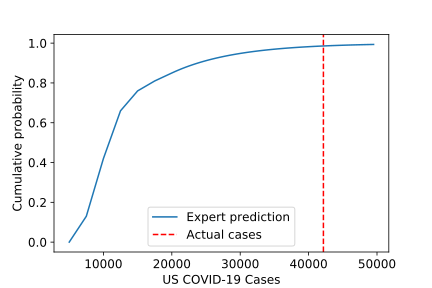
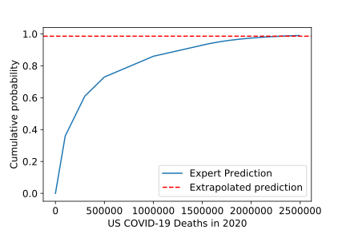

It's time for the USA to get very serious about the threat that COVID-19 poses
to the country.

Fivethirtyeight [recently
reported](https://fivethirtyeight.com/features/infectious-disease-experts-dont-know-how-bad-the-coronavirus-is-going-to-get-either/)
on a [survey](https://works.bepress.com/mcandrew/2/) of experts who were asked
several questions on 16-17 March. Among those questions (paraphrased):

1. How many cases of COVID-19 do you expect will be reported in the US by March
   23, 2020? (a week from the survey date)
2. How many Americans will die of COVID-19 in 2020?

It is now after March 23. The methodology I will follow below is to use the
error in the answer to the first question as an estimate of the error in the
answer to the second question. Now, this approach is far from perfect. There
are plenty of reasons that the error in the estimate of the number of cases
might not be correlated with the error in the death estimates. But I want to
call attention to the threat this poses.

Here are the headline numbers:

* One would hope that actual results would be around the 50th percentile of
  expert estimates. The would mean that half of experts guessed too high, and
  half guessed too low. In this case, it was at the 98th percentile (far above
  the typical expert prediction). That means that only 2 out of 100 experts
  would have expected we'd face the actual number of cases or more.
* Extrapolating that to number of COVID-19 deaths in the USA in 2020, that
  would imply that around 2.3 million Americans will die from this. But that's
  based on assuming these experts are equally wrong about this number. And
  there is still plenty we can do to reduce the number of deaths. Strict
  adherence to physical distancing is one of the best things you can do to help
  accomplish that.

Let me be very clear that I do not in any way mean any sort of attack or
disrespect to the experts who participated in that survey. Indeed, I recommend
reading the Fivethirtyeight article, which eloquently explains that even
experts are dealing with a great deal of uncertainty and working with imperfect
information. I have nothing but respect and appreciation for these experts, who
are kind enough to share their informed opinions with us at a time when we're
all pretty concerned.

Details on the approach: The idea here is to turn the expert predictions into a
cumulative probability distribution, as shown here:

Let me explain how to read that chart. The x-axis gives the number of COVID-19
cases predicted for March 23. The y-value at a given x-value gives the fraction
of experts who expected fewer cases than that. For example, 15000 cases
corresponds to a cumulative probability of around 0.75. That means that 75% of
experts thought we'd have fewer that 15000 cases in the US; only 25% of experts
thought we'd have more.

The actual number of cases ([42164 on 23
March](https://covidtracking.com/us-daily/)) corresponds to a value of over
0.98. This means that over 98% of experts thought we'd see fewer cases than we
actually did, and fewer than 2% that we'd see this many or more.

Now we'll make a similar plot for the expert estimates of how many American
deaths will be due to COVID-19 during 2020.

This plot is just like the previous one. The number of deaths is along
the x-axis, and the y-axis represents the fraction of experts who predict fewer
deaths than that number. The "average" expert (cumulative probability of 0.5)
predicts about 200,000 US deaths, as the Fivethirtyeight article said.

The red dashed line marks the percentile for the error in estimates of
confirmed cases. It intersects the expert predictions at around 2.3 million
deaths. I caution against taking this as a serious predictor of the number of
deaths the US will face, but I believe this does suggest that the situation
should be taken very seriously.

A few more details: This all falls in the tails of the distributions, so the
important question is how I constructed those tails. I assumed an exponential
tail. The parameters were fixed by matching the probability density at the edge of the uppermost bin and by normalization.
All details of this procedure, including the source code to reproduce it, are
available in the `expert_reanalysis` directory at: [https://github.com/dwhswenson/covid19-data-science](https://github.com/dwhswenson/covid19-data-science)

Caveats: As stated previously, there's no specific reason to assume that the
error in death estimates is correlated to the error in estimated cases.
Furthermore, because the experts so strongly underestimated the number of
cases, the death estimates come from extrapolating from the tails of
distributions, which means that the numbers are extremely sensitive. If the
values were around 95th percentile instead of 98th, that would shift the number
of deaths by over half a million.
