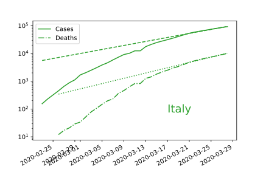
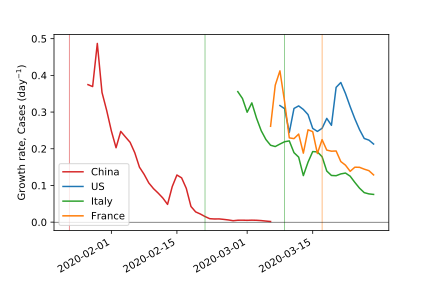
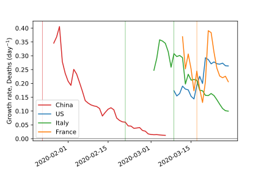

It isn't trivial to compare the effectiveness of strategies used by different
countries to manage the COVID-19 pandemic. Raw counts of deaths and confirmed cases mask differences in population size and testing strategies. However, the exponential growth rate is a quantity that can be extracted from that data, and that can be useful to compare different countries.

## Review: Exponential fits and semi-log plots

In a [previous post](/2020/covid-19-death-trends-26-mar/), I described how to
read these semi-log plots.  In that post, I only focused on deaths; in this
post I'll look at both deaths and confirmed cases.  To review, let's check the
latest data from Italy:

You see a curve for the data (here, solid for total confirmed
cases and dot-dashed for total deaths) and a straight line (dashed for cases,
dotted for deaths) that represents an extrapolation from the last few days (in
this case, the last 10). What we want to see is that the actual data lies below
the extrapolated line. That indicates that things are getting better.
Eventually, we want that extrapolation be perfectly horizontal. 

In this post, I'll look at how the slope of that line is changing in over time
for several countries. In Italy, it is getting more horizontal (smaller slope),
which is what we want to see. 

## What are we measuring?

I'll be looking at an estimate of the growth rate for the process, assuming (local) exponential kinetics. This is closely related to the inverse (reciprocal) of the doubling time. That is, if the rate goes down, the doubling time gets longer. (Mathematically, the rate $k$ and doubling time $t_d$ are related as $t_d = \ln(2) / k \approx 0.693 / k$.) A low rate (and long doubling time) are what you want to see. The growth rate is also related to the basic reproduction number $R_0$ by way of $t_I$, the average time that someone in infectious: $R_0 = k t_I$.

## Time evolution of fitted growth rates

First, let's look at the growth rates for total confirmed cases for several
countries as a function of date.

The thin vertical lines represent the start
dates of lockdowns; for China, that is the Hubei province lockdown; for Italy,
the earlier date is the lockdown in northern Italy and the later date is the
national lockdown; and for France it is the national lockdown.

The goal is to reduce the growth rate to zero. The data shown here starts after
the country has 100 cases. China quickly reduced its growth rate to zero. Italy
has been steadily decreasing. France stabilized around a value of 0.2-0.25 for a
while before establishing a national lockdown, and has been decreasing ever
since. In the 3 weeks since the US reached 100 confirmed cases, its growth rate
has not changed significantly, although it may be starting to show a decrease.

We can look at the same data for deaths. Here, China and Italy tell the same story as for confirmed cases. However, France and the US are different. France's death rate has been a bit all over, I believe that this is at least in part because the data set that I use doesn't have update for France for every day, so it looks like there are no new deaths and then a bunch of new deaths. In any case, France has not decreased its growth rate for deaths by anywhere near as much as it has decreased its growth rate for confirmed cases. Deaths are continuing to grow as fast as before, but confirmed cases are growing more slowly. This could indicate that the drop is cases is actually due to a drop in testing, or it could be the signs of a healthcare system getting close to being overwhelmed.

As I discussed in a previous post, the rate of increase in deaths in the US has actually increased. My best guess is that this is a result of community infection taking hold, although it might also be the result in previously insufficient testing (people dying without being tested). The may be a slight downward trend in recent days, but nothing comparable to the reductions seen in China or Italy.

A final point that is worth mentioning: note that, at least in these countries, the growth rates near the beginning of the outbreak tend to be in the 0.2-0.4 range. This indicates that this growth rate may be a reasonable tool for comparing the response of different countries to this pandemic; this is expected in theory, since the growth rate is mathematically connected to other measures such as the reproduction number.  In addition, we see that the growth rates are of similar magnitude for both confirmed cases and for deaths, which suggests that it isn't a metric that depends on the fraction of actual cases being tested. I'll explore some of these ideas further in future posts.

## Technical details

The plots are based fitting the exponent with a nonlinear fit based on the 5 days including and prior to the date associated with the value. This procedure gives poorly defined results when the number of new daily deaths is zero; therefore only the first 45 days of data for China were used. The choice to use 5 days is based on a trade-off between less noisy data (use more days) and faster response to recent trends (use fewer days). Data for deaths are only counted starting from the 10th death; data for confirmed cases are only counted starting from the 100th confirmed case.

All data is from the Johns Hopkins live updating dataset, available [here](https://github.com/CSSEGISandData/COVID-19).
The analysis tools are in my COVID-19 data science repo at [https://github.com/dwhswenson/covid19-data-science](https://github.com/dwhswenson/covid19-data-science).
The things to create this particular post are part of [dwhswenson/covid19-data-science#3](https://github.com/dwhswenson/covid19-data-science/pull/3).
