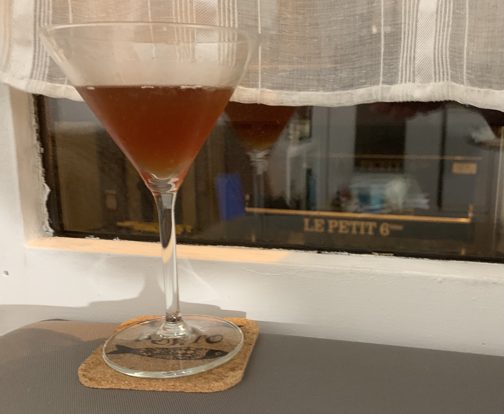

Here's a story of how I ended up creating a cocktail. It was October, 2020.
The afternoon before the second French lockdown was announced, I received a
phone call from a [favorite local liquor store](https://www.malleval.com/),
telling me that a favorite liqueur was back in stock (not in this recipe, but
Luxardo's Maraschino liqueur, which is essential for a Last Word or for an
Aviation).

That evening, the lockdown was announced, with just over 24 hour notice. In my
preparations the next day, I dropped by that liquor store to pick up the
ingredient I'd waited for. While I was there, and hearing the employees trying
to figure out what this lockdown meant for them, I, on a whim, decided that I'd
spend the lockdown working on a new recipe incorporating: Cherry Heering.
(Note: I'm fortunate to have a job that the lockdown didn't affect. This is
pretty much the definition of privilege. I figured the extra money I spent was
both for my own fun and in the hopes that a few extra Euros might be part of
keeping people employed.)

I remembered Cherry Heering as an ingredient in some pre-Prohibition cocktail
books; books that seem antediluvian to me. So I decided I'd try to forge my own
path with it. Granted, in the world of cocktails, I tend to assume that
everything can be done has been done, so someone else has probably created
something similar. Still, now that we're out of lockdown, here's my result, so
others might enjoy:

### Deuxième Confinement 

(If you're not comfortable with French, call it Lockdown \#2)

* 2 oz Bourbon whiskey
* 1/2 oz lime juice
* 1/2 oz Cherry Heering
* 1/2 oz simple syrup
* 1/2 oz Grand Marnier
* rinse cocktail glass with absinthe (e.g., Grande Absente)

After washing glass with the absinthe, shake other ingredients over ice and
serve in cocktail glass.

It's a much happier drink than its name would suggest. I hope you can enjoy it
any time your spirits could use a boost.
