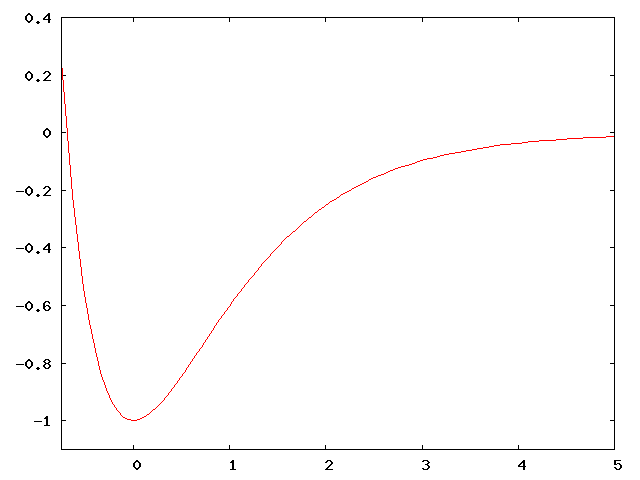
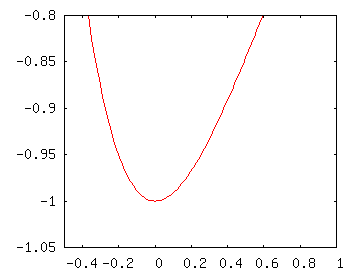
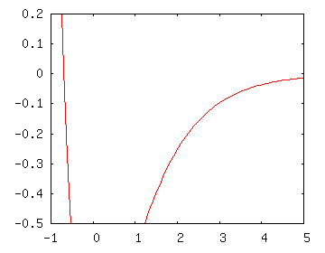
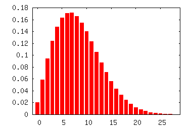

## 1. Energy Levels in the Morse Oscillator 

In class, we saw that the energy levels for different potentials are spaced
differently, and that the spacing is related to the shape of the potential.
Specifically, we saw that the energy level for the particle in a box get
more widely spaced as the energy level $n$ increases, that the harmonic
oscillator energy levels are always the same, and that the hydrogen atom
energy levels become more closely spaced as $n$ increases.

{: .right-image}

The Morse potential is given by the equation:

$$
V(x) = D (e^{-2\alpha x} - 2 e^{-\alpha x})
$$

It provides a relatively good approximation to a chemical bond. The graph of
$V(x)$ is shown at the right for $D = \alpha = 1$.

How would you expect the energy levels to be spaced for small $n$? What
about large $n$? Don't bother solving the Schr&ouml;dinger equation (even
though it can be solved exactly for this potential; just use your intuition.
[Hint: for small $n$, consider energies less than -0.8. For large $n$,
consider energies larger than -0.5.]

<a href="#bonus_1" class="toggle_answer">See answer...</a>

{: .right-image}

The point of this exercise is to take small sections of the Morse potential
and see how they compare to the potentials we know. For low values of $n$
(energies less than around -0.8 in the diagram) the potential looks like
what you see to the right.

As you can see, this looks a like a slightly lopsided harmonic oscillator
potential. Since the energy level spacing depends on the shape, we would
expect the energy levels to be spaced about evenly (as with the harmonic
oscillator). Since the anharmonicity (fancy word meaning "not shaped like a
harmonic oscillator") makes it look a little like a hydrogen atom potential,
we'd expect levels to get a little more closely spaced.

{: .right-image}

At higher energies, the Morse potential looks more like a hydrogen atom
potential. For the hydrogen atom, we know that the energy levels get more
closely packed together, so we would expect similar behavior in the
high-energy Morse potential. A plot focusing on the Morse potential at high energies is shown to the right.

-----

## 2. Vibrational vs. Rotational Energy Levels

In class, we saw the "rigid rotor harmonic oscillator" approximation for a
diatomic molecule. This approximation assumes (among other things) that the
vibrational motion can be separated from the rotational motion. This means
that the total energy for the system is the sum of the vibrational energy
and the rotational energy.

We also discussed that the spacing between vibrational energy levels is
substantially larger than the spacing between low rotational energy levels. So
for this bonus problem, we're going to explore that idea in more detail. We'll
use N$_2$ as an example system. We were given $\hbar\omega = 2360\
\text{cm}^{-1}$ and $B = 2\ \text{cm}^{-1}$.

Representing the states with the vibrational
quantum number $v$ and the rotational quantum number $J$ by the
ordered pair $(v, J)$, we'll try to answer the following questions:

1. For a given vibrational state, how many rotational states have energy less
   than the next vibrational state? That is, find $J$ such that the energy of
   the state $(v, J)$ is greater than or equal to the energy of the state 
   $(v + 1, 0)$. Note that since the vibrational energy level spacing is even
   (from the harmonic oscillator approximation), this will be the same for any
   vibrational level $v$.
2. After what rotational level does the rotational spacing become larger
   than the vibrational spacing?

<a href="#bonus_2" class="toggle_answer">See answer...</a>

<ol><li markdown="1">

First we'll figure out the spacing for the vibrational levels:

$$\hbar \omega ((v+1) + 1/2) - \hbar\omega (v + 1/2) = \hbar\omega$$

We're looking for $J$ such that the energy of the rotational motion, $B J(J +
1)$ is greater than or equal to $\hbar\omega$. Since the rotational energy
increases as $J$ increases, we just need to find the value of $J$ for which the
energy is exact, and round up to the next integer. So we solve the quadratic
equation:

$$ \begin{align*}
BJ(J + 1) &= \hbar\omega \\
BJ^2 + J - \hbar\omega &= 0  \\
J &= (-1 + \sqrt{1 + 4B\omega\hbar}) / 2
\end{align*}
$$

where the positive root is chosen because $J$ must be positive. Plugging in
the numbers for N$_2$, we obtain $J = 33.9$, so the lowest physically
meaningful $J$ for which this is true is $J = 34$.

</li>

<li markdown="1">

As above, the vibrational energy spacing is $\hbar\omega$. Now we need to
find the rotational energy spacing; that is, the energy difference between
the rotational state $J + 1$ and the rotational state $J$.

$$ \begin{align*}
E_{J+1} - E_J &= B(J + 1)(J + 2) - BJ(J+1) \\
 &= B(J+1)((J+2) - J) = 2B(J+1)
\end{align*} $$

Setting this equal to the vibrational spacing $\hbar\omega$ and rearranging
a bit, we obtain $J = \hbar\omega / 2B - 1$. Plugging in the numbers for
N$_2$, we find that $J = 589$.

</li>

</ol>

When we compare the energy spacings to the thermal energy, we note that the
average thermal energy at room temperature is about a tenth of the
vibrational energy spacing, but is a hundred times the rotational energy
constant. The thermal energy would correspond to a rotational quantum number
of $J = 9$ or $10$, substantially less than the $J = 34$ of part 1.

As mentioned in the problem, the ratios of different states at a given
temperature can be calculated using techniques which you will learn in your
introductory course on statistical mechanics and thermodynamics.  For the
vibrational distribution, you can see the calculation done on page 742 of
McQuarrie and Simon, which gives $1.31\times 10^{-5}$ as the fraction in the
first excited vibrational state, with nearly everything else in the ground
state.

{: .right-image}

The rotational states have a more interesting distribution. The details of
the calculation can be found on pages 744-748 of McQuarrie and Simon (but be
careful, because the $B$ described in class is defined a little differently
than in a different way than McQuarrie and Simon). The graph to the right
plots the fraction of molecules in the first few energy levels. As you can
see, the peak is around $J = 6$ or $7$. A rotational quantum number of 
$J = 34$ would be extremely unusual at room temperature. In fact, it would
contribute a little less to the total population than the first excited
vibrational state does, since what actually determines the contribution is
the energy (and the energy for $J=34$ is a little higher than the energy for
$v=1$).

## 3. Single photon excitation paths

We saw that the selection rules for a one-photon process are $\Delta L = \pm
1$ and $\Delta S = 0$. In this bonus problem, we're going to look at the
transition of a hydrogen atom from its ground state configuration ($1s^1$)
to the excited state configuration $4p^1$ by consecutive single-photon
processes.

You'll probably want to start by listing all the possible configurations
between $1s^1$ and $4p^1$ (e.g., $2s^1$, $2p^1$, etc.) and finding term
symbols for each of those states (remember that $p^1$ defines the term
symbol, so $2p^1$ has the same term symbol as $3p^1$, and so forth). You may
want to lay them out in a table: Fig. 8.4 (p. 307) and Fig. 8.5 (p. 308)
might give you some ideas.

So the question for you to answer is: If you have one photon, how many paths
get you from $1s^1$ to $4p^1$? How many paths are there with two photons?
What about four photon? Five? (The real show-offs should try three photons.)
